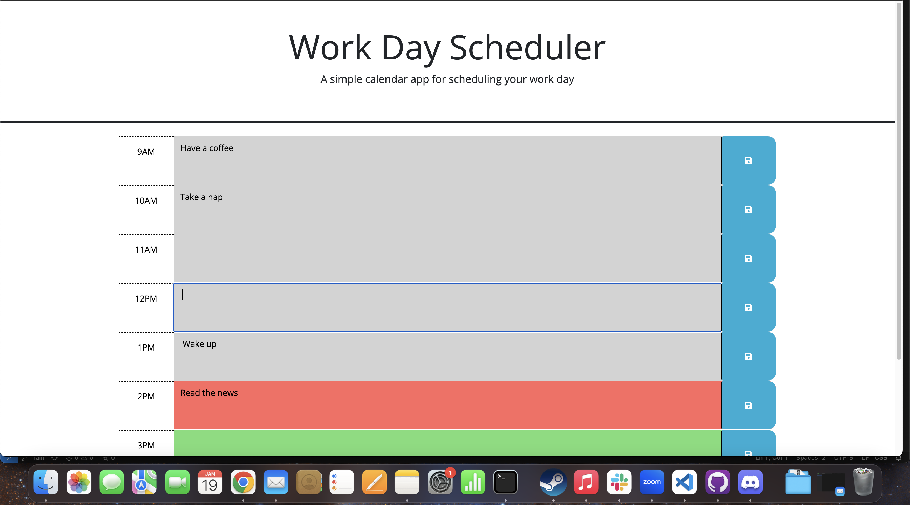

# <Easy Plan>

## Description

Provides an event planner that can save different tasks for each hour-time-slot, displays current day at the top and color codes hours slots based on whether they are current, in the past, or in the future

## Table of Contents (Optional)

- [Installation](#installation)
- [Usage](#usage)
- [Credits](#credits)
- [License](#license)

## Installation

No Installation required, page is already live

## Usage

Simply hover over the time slot, tyoe in your task and click the save button

## Credits

Lots of google to properly understand Jquery tree traversal

## License

Standard MIT license

---